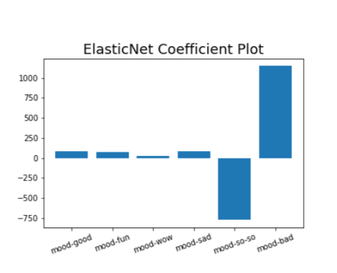
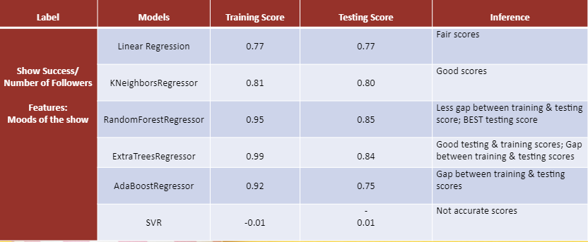
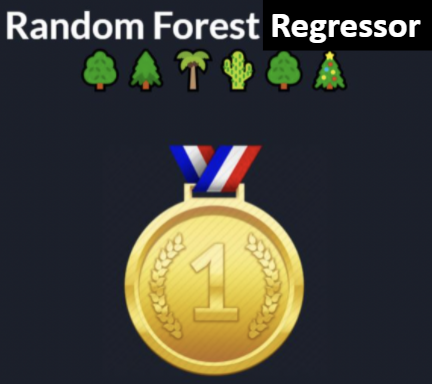
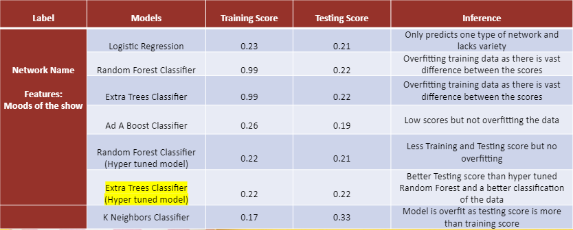
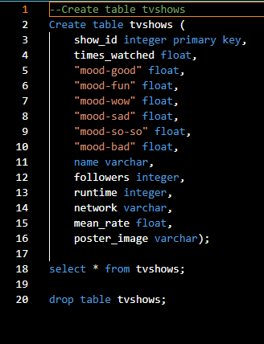
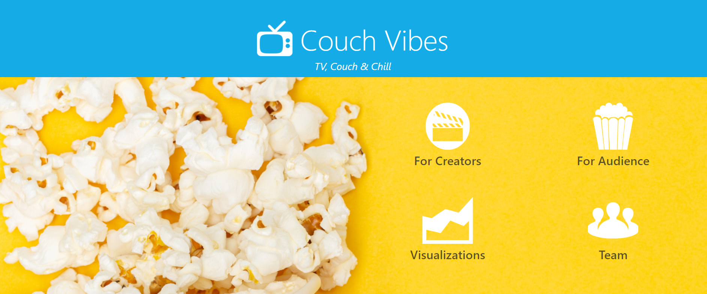

# Team-Project 4
# The Couch Vibes - TV, Couch & Chill

**[The Couch Vibes Heroku Link](https://couch-vibes.herokuapp.com/)**

## **Table of Contents**

- [Background & General Info](https://github.com/meetk5/Team-Project4#background--general-info)
- [Technologies](https://github.com/meetk5/Team-Project4#technologies)
- [Machine Learning Model 1- The Show Success Model](https://github.com/meetk5/Team-Project4#machine-learning---model-1---the-show-success-predictor-model)
- [Machine Learning Model 2- The Network Model](https://github.com/meetk5/Team-Project4#machine-learning---model-2---the-network-predictor-model)
- [Deploy](https://github.com/meetk5/Team-Project4#deploy)
- [Website Design](https://github.com/meetk5/Team-Project4#website-design)
- [Visualizations & Analysis](https://github.com/meetk5/Team-Project4#visualizations--analysis)
- [Heroku](https://github.com/meetk5/Team-Project4#heroku)
- [Lessons Learned](https://github.com/meetk5/Team-Project4#lessons-learned)
- [Inspiration](https://github.com/meetk5/Team-Project4#inspiration)
- [Team Members](https://github.com/meetk5/Team-Project4#team-members)

## **Background** & General Info

Television became a modern-day necessity towards the second half of the 20th century. Since the 1950s, it has only increased in terms of content, broadcasting networks, and hours of entertainment.

Today, American networks play thousands of different programs every day. Some programs/shows like Seinfeld, Friends, Breaking Bad, Game of Thrones, etc. go on to define an entire generation while some slip away into oblivion due to several reasons. 

As a viewer, it also becomes very difficult to decide what to watch and wherewith the limited time that we have these days. For our final project "Couch Vibes", we used a supervised machine learning model to address these two points.

In our first supervised model **"Show Success Predictor Model"**, we utilize different mood reactions in our dataset to predict the number of followers that a show can reach and whether it will achieve success or not. This model is particularly helpful for network executives to determine whether a show will achieve success or not based on reactions to its pilot.

In our second supervised model **"Network Predictor Model"**, we suggest a network to the user based on their current mood. We utilize the same mood reactions as before as an input in our model. Additionally, we also provide users with a dropdown to select a preferred runtime, so that we can recommend 5 Popular shows for the suggested network. This model is helpful for viewers to determine what they want to see when they unwind at the end of the day.

#### **Data sources:** 

For our website, we used [TV Times Shows Dataset](https://www.kaggle.com/oscarfry/tvtime-shows) that has 2 csv files (all_episodes.csv and tvtimeshows.csv). All_episodes.csv had 413k rows and 14 columns.Tvtimeshows.csv had 19k rows and 10 columns. While going through our data we were able to decide that we will do 2 different machine learning models one for creators and one for audience and visualizations around the popular shows based on times watched, followers, runtime, either in prime time or out of prime time.

For our project, we had different data sets for each machine learning models and visualizations and to deploy our website in Heroku, we used a reduced dataset from model 2 for Heroku deployment. 

## **Technologies**

- Python (Jupyter Notebook, Pandas)
- Flask 
- SQL/ Postgres DB
- JavaScript Libraries (D3, Plotly, Leaflet)
- HTML/ CSS (Bootstrap)
- Csv
- Machine Learning
- Tableau

## **Machine Learning - Model 1 - "The Show Success Predictor Model"**

You can see the details below what we have done for the Show Creators:
- Show success predictor
- Predict the show success based on the moods of the show
- Features: Mood of the show on the range of 1-100
- Label: Number of followers of the show
- Regression model

These are the steps: 
1. Data Cleaning
    - Removing extraneous columns
    - Null values
    - Duplicates
    - Merging datasets by grouping shows
2. Individual scatter plots for each feature
3. Regularization: Coefficient plots with Linear Regression, Lasso, Ridge & ElasticNet
4. Function to test the familiar Regressors
5. Scaling the data – StandScaler & MinMaxScaler
6. Model Selection & Prediction
7. MSE & R-squared score: Lesson Learnt 
8. Exported the model -> Flask implementation

Regularization: Coefficient plots with Linear Regression, Lasso, Ridge & ElasticNet

#### Scores of Show Success Predictor Model: 

**Model Comparison for Show Success Predictor** is the Random Forest Regressor

## **Machine Learning - Model 2 - "The Network Predictor Model"**

You can see the details below what we have done for the Network Model:

- Network Predictor
- Suggest the Network to watch based on the mood of the user
- Features:Moods of the user in the range 1-100
- Label: Network
- Classification model

These are the steps: 
1. Data Cleaning
    - Removing extra columns, Null values, Duplicates
    - Filtered based on specific runtime (15-90 mins), Top 10 US Networks, Number of episodes
    - Removed special entries like sports events, live events, awards, etc.
    - Removed all entries where all mood reactions were 0 
    - Removed data related to Netflix as it was skewing our entire data and model due to several entries
    - Merging datasets by grouping shows
2. Label Encoding of Labels (Networks) and MinMaxScaler scaling (between 1-100) of input data (Moods)
3. Splitting Training & Testing Data
4. Hyper tuning parameters, Model, Fit & Predict Classification models
5. Exported the model -> Flask implementation
6. Reverse Label Encoding in Flask to display Network Name

#### Scores of Network Predictor Model: 

**Model Comparison for Network Predictor** is Extra Trees Classifier (Hyper tuned model)

## Deploy

In visual studio code using javascript, we used our data set as cvs files. 

We later deployed flask app to run our models on local server. We also used SQL database for Network Predictor Model for tv shows to create tables and reduced dataset.

We were able to create visualizations in Tableau, embed a Tableau story on to a HTML for our website.

## Website Design

We created one Landing page and 4 other pages using Bootstrap and CSS as following:
- Landing page with 4 links to other pages.
- Network page, which gives network suggestion based on model. Uses sliders and dropdown for parameters.
- Followers page, which predicts whether a show will be successful or note based on model. Uses sliders for parameters.
- Visualizations page that displays analysis using Tableau visualizations.
- Team page that has team information.

**Landing page**

## Visualizations & Analysis

We created several visualizations and made one story in Tableau to show TV Broadcasting Trends in USA. We used different dataset for our visualizations which contains 24 columns and 81k rows.We did not clean up visualization to see whatever available as visualizations from 1927 to 2020. We used group, set and parameter function to have concise graphs. We used trend lines, charts, treemaps for our graphs. Based on our data set, these are the visualizations that we created in Tableau:

- The trends lines of TV consumption over the years in USA based on times watched and followers
- The trend lines by top channels over the year as per followers, filter option by year slider
- The most watched shows by channels,filter option by prime time in or out
- The Flash (2014) - The most watched show review: The trends of total mood and Times Watched by episode and trend lines of total reaction to the show.
- Top channels and shows  in prime time (8-11pm) as per times watched in bar chart and followers in line graph. 
- The most popular shows by channel as per runtime - out of prime time 
- Top 10 shows based on prime time (between 8-11pm) by runtime group (15-30 min, 31-45 min and 46-60min). All of shows are in the CW between 31-45 min runtime in prime time slot.
- Filter by run time and year, find the shows. Run time filter by 20-90 mins 

You can visit our website to see more visualizations. 

## Heroku

**[Couch Vibes Heroku Link](https://couch-vibes.herokuapp.com/)**. We were able to deploy our app to Heroku.

## Lessons Learned
- Getting runtime dropdown in the network predictor page was a challenge. The JavaScript code was complicated and needed to filter network and runtime parameters and sort it based on the followers to get the show name. In the end we wrote a sql query that would pass our data in a descending sort order based on followers. We then wrote a javascript part where then filtered based on the other two parameters.
- In terms of Machine Learning, we learnt that when data of one category is enormous, it'll skew the model and will always predict that category. In our case it was Netflix that had varied data that we had to exclude to make our model dataset balanced.
- We had quite an issue while deploying on Heroku as our model files (in joblib formats) were very large in size and we were getting error in heroku about pickle and unpickling. We compressed our model files using bz2file python library and modified our requirements file for heroku with bz2file and pickle library. This enabled us to deploy our app on heorku. 

## Inspiration

Our inspiration for this project were Rutgers Data Science Bootcamp and Good TV Shows.

## **Team Members**

- [Brian Johnson](https://github.com/Bjohnson08021/)

- [Kate Yayla](https://github.com/Kate-Yayla)

- [Jay Dhruv](https://github.com/jaybdhruv)

- [Meet K Kaur Sahni](https://github.com/meetk5)

- [Saleha Ahmed](https://github.com/saleha456)
